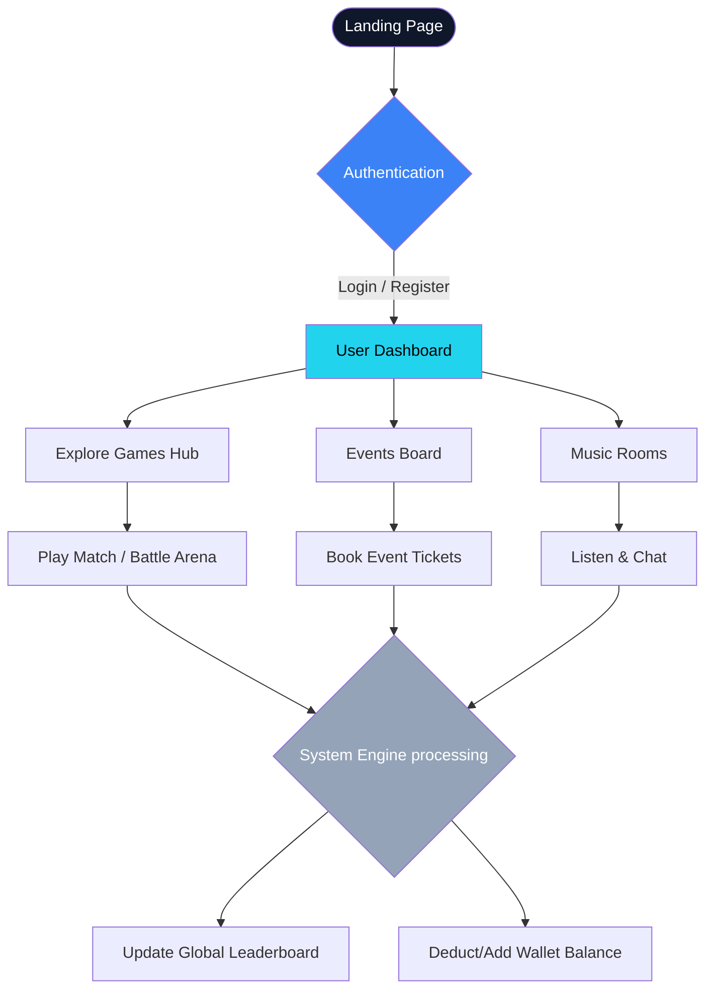
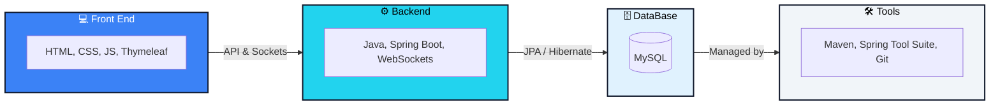
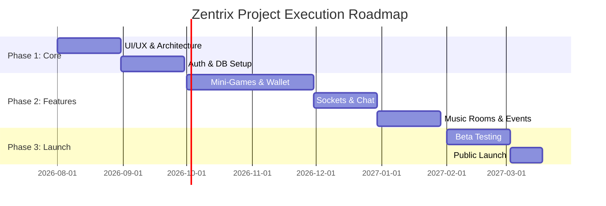

# Zentrix (Youth) - Project Blueprint

 

## 1. Introduction about the Project Subject
**Zentrix (Youth)** is an innovative, digital-first platform designed exclusively for the modern youth demographic. By seamlessly blending multiplayer gaming, real-time social networking, synchronized music streaming, and a dynamic virtual economy into a single ecosystem, Zentrix creates the ultimate virtual hangout space.

## 2. Project Overview
Zentrix is a comprehensive web-based application utilizing a modern tech stack (Spring Boot, Java, HTML/CSS/JS, WebSockets). It features a robust suite of modules including casual multiplayer mini-games (Ludo, Chess, Mario, etc.), live battle arenas, real-time music listening rooms, event ticketing, and an integrated wallet system that drives the platform's virtual economy.

## 3. Problem Statement
> [!WARNING]
> The current digital landscape is heavily fragmented. Youth users must constantly switch between disparate applications for gaming, listening to music together, and finding social events. This fragmentation leads to a disconnected social experience, higher screen fatigue, and poor user retention for single-utility applications.

## 4. Objectives
* **Unify Entertainment:** Consolidate casual gaming, synchronized music, and social events under one roof.
* **Foster Engagement:** Utilize advanced gamification mechanics (leaderboards, achievements, 1v1 battles) to maximize daily active users (DAU).
* **Monetize Interactions:** Implement a seamless virtual wallet and digital currency system for microtransactions.
* **Build Community:** Enable real-time, organic interactions via music rooms, messaging, and community leaderboards.

## 5. Project Scope
The development scope is divided into progressive phases:
* **Phase 1:** Core platform setup, 10+ casual mini-games, user profiles, auth, and virtual wallet creation.
* **Phase 2:** Live Battle Arenas, synchronized music rooms, global leaderboards, and real-time chat integration.
* **Phase 3:** Event management system for organizers, physical/virtual event ticketing, shop integration, and advanced monetization features.

## 6. Target Audience / Users
* **Primary:** Gen Z and young millennials (ages 13 - 24) who seek casual entertainment and social connection.
* **Secondary:** Casual gamers, college students, digital creators, and local event organizers.
* **Geographies:** Initial rollout focusing on the rapidly growing Indian digital market, with scalable architecture for global expansion.

## 7. Market Research
* **India Market Research:** India is experiencing explosive growth in smartphone penetration. With over 400 million active gamers, the casual and real-money gaming market is booming.
* **Global Market Research:** The global social gaming market is projected to surpass $150 Billion by 2027.
* **Pricing Analysis:** A "Freemium" model is the industry standard. Core access remains free, while microtransactions drive revenue.
* **Market Trends:** Convergence of social media and gaming (Metaverse-lite experiences), synchronized media consumption.
* **User Needs Analysis:** Users are seeking safe communities, instant gratification through hyper-casual games, and peer recognition via leaderboards.

## 8. Existing Features
* Diverse Mini-Games Collection (Ludo, Chess, Mario, Candy Crush, Runner, Snake & Ladder).
* Real-time Music Rooms.
* Virtual Wallet & Digital Shop system.
* Event Registration, Ticketing, and Organizer dashboard.
* Comprehensive User Profiles, Personal Dashboards, Messages, and Achievements.

## 9. Existing System Drawbacks
Current platforms in the market isolate functionalities. Pure gaming apps lack organic social discovery. Pure chat apps require users to rely on third-party bots or external games for entertainment. Most platforms also suffer from complicated onboarding.

## 10. Unique Features
* **The Battle Arena:** Integrates casual web games with direct social rivalries and stakes.
* **Synchronized Music Rooms:** Users can listen to music together seamlessly while navigating the platform or playing games.
* **Unified Virtual Economy:** A single wallet connects event ticket purchases, game wagers, and digital shop cosmetics.

## 11. Features to Include
* Integrated Voice Chat in gaming arenas and music rooms.
* AR (Augmented Reality) avatars for user profiles.
* Live streaming of high-stakes community battles.
* AI-driven personalized match-making and event recommendations.

## 12. Future Enhancements
* Native Mobile Application rollout (iOS & Android).
* Web3 & Crypto wallet integration for digital asset ownership.
* B2B Brand partnerships for sponsored in-game rewards and branded arenas.

## 13. Competitors Analysis
* **Hago:** Strong in casual gaming and voice chat, but lacks real-world event management and has issues with toxic communities.
* **Discord:** Excellent for community building, but games are external or bot-reliant. High learning curve.
* **MPL (Mobile Premier League):** Highly successful in gaming/betting, but severely lacks organic social interactions and casual hangout spaces.

## 14. Feature Comparison

| Feature | Zentrix (Our Platform) | Hago | Discord | MPL |
|---------|-----------------------|------|---------|-----|
| Casual Gaming | ✅ Native (10+ Games) | ✅ Native | ❌ External/Bots | ✅ Native |
| Synchronized Music | ✅ Yes | ❌ No | ✅ Via Spotify Link | ❌ No |
| Event Ticketing | ✅ Yes | ❌ No | ❌ No | ❌ No |
| Virtual Economy | ✅ Yes | ✅ Yes (Gifting) | ❌ No | ✅ Yes (Betting) |

## 15. Our Pricing & Existing Websites Pricing
* **Zentrix:** Free entry and platform usage. Monetization through 5-10% platform commission on premium battles, and in-app virtual purchases.
* **Competitors:** MPL takes 10-15% commission on matches. Discord Nitro is subscription-based at $9.99/mo. Hago relies heavily on user-to-user virtual gifting cuts.

## 16. Revenue of the Existing Websites
* **Discord:** ~$130M+ annual revenue (primarily via Nitro subscriptions).
* **MPL:** ~$100M+ annual revenue (via entry fees and platform commissions).
* **Hago:** Tens of millions annually via virtual currency sales for gifting.

## 17. Workflow
**Standard Loop:** User signs up ➔ Claims daily rewards/Funds Wallet ➔ Enters a Battle Arena or Music Room ➔ Engages socially and completes matches ➔ Earns achievements/currency ➔ Spends currency in the Shop or on real-world Event Tickets.

## 18. User Flow

## 19. System Architecture

## 20. Modules Overview
* **Auth & Identity:** Secure login, registration, JWT integration, and profile management.
* **Game Engine:** HTML5/Canvas-based casual games with WebSocket state management.
* **Social Hub:** Messaging system, Music Rooms, and global leaderboards.
* **Economy Hub:** Secure Wallet, transaction logs, digital Shop, and reward redemption.
* **Event Engine:** Admin/Organizer event creation, user browsing, and ticket generation.

## 21. User Roles & Permissions
* **User:** Standard access to play games, chat, book events, and manage their personal wallet.
* **Organizer:** Upgraded access to create events, manage ticket sales, and track attendee data.
* **Admin:** Full global oversight, dispute resolution, game management, and financial dashboard access.

## 22. Technology Stack
* **Frontend:** HTML5, CSS3, Vanilla JavaScript, Thymeleaf, Lottie Animations.
* **Backend:** Java 17, Spring Boot (Web, Data JPA, Security, WebSocket).
* **Database:** MySQL.
* **APIs & Integrations:** Payment Gateway (Stripe/Razorpay), JWT for API Security.
* **Database Design:** Normalized tables for `users`, `wallets`, `transactions`, `events`, `tickets`, and `music_rooms`.

## 23. Existing Similar Apps in India & Globally
* **India:** MPL, WinZO, Loco (Streaming focused).
* **Globally:** Hago, Plato, Yubo, Discord.

## 24. Comparison with Features
Zentrix uniquely bridges the gap between digital interaction (games/music) and physical/organized experiences (event ticketing), unlike any other platform currently available which focuses on only one or two dimensions. (See full table in section 14).

## 25. How Much Users They Have
* **Hago:** 100M+ global downloads.
* **MPL:** 90M+ registered users in India and abroad.
* **Plato:** 10M+ active users relying purely on word-of-mouth.

## 26. How They Got Popular
* **Aggressive Influencer Marketing:** Loco and MPL heavily sponsored gaming YouTubers and influencers.
* **Viral Loops:** Hago and WinZO utilized aggressive referral programs ("Invite a friend, get cash").
* **Timing:** Plato grew massively during pandemic lockdowns by providing a simple, ad-free space to hang out.

## 27. What Mistakes They Did
* **Hyper-focus on Betting:** MPL alienated casual users by focusing too heavily on real-money gambling.
* **Poor Moderation:** Yubo and Hago faced massive backlash for toxic communities and unsafe environments for minors.
* **Bloated UI:** Many apps became too complex, causing new users to churn instantly.

## 28. How We Can Do Better
Zentrix will focus on **"Entertainment First, Monetization Second."** We will implement strict automated and manual community guidelines, provide a stunningly clean and modern UI, and ensure that the platform remains fun even for users who do not spend real money.

## 29. What People Are Looking For? What's Lacking
Young users are looking for a "Digital Third Place"—a safe, engaging environment to chill online with friends after school or work. Currently lacking is a platform that natively supports synchronized music listening while playing games, without requiring high-end PC setups or multiple heavy applications.

## 30. How We Can Get A Solution
By executing on the Zentrix vision: A lightweight web platform (accessible anywhere) that natively handles low-latency WebSockets for gaming and music, combined with a local event discovery engine that bridges their digital and physical social lives.

## 31. Project Execution Plan

## 32. Team Needed for the Project
* 1x Project Manager / Product Owner
* 2x Frontend Developers (UI/UX focus & HTML5 Canvas expertise)
* 2x Backend Developers (Spring Boot, WebSocket, Database architecture)
* 1x QA / Test Engineer
* 1x Marketing & Community Manager

## 33. How Will We Commercialize It & Make Money
* **Platform Commission:** A fixed percentage cut from users participating in paid Battle Arenas.
* **In-App Purchases (IAP):** Selling virtual avatars, profile themes, and shop items for the digital wallet.
* **Ticketing Convenience Fees:** A small markup fee for booking real-world/virtual events through the platform.
* **Brand Sponsorships & Ads:** Selling non-intrusive ad space, sponsored music rooms, or branded game environments to youth-focused brands.
